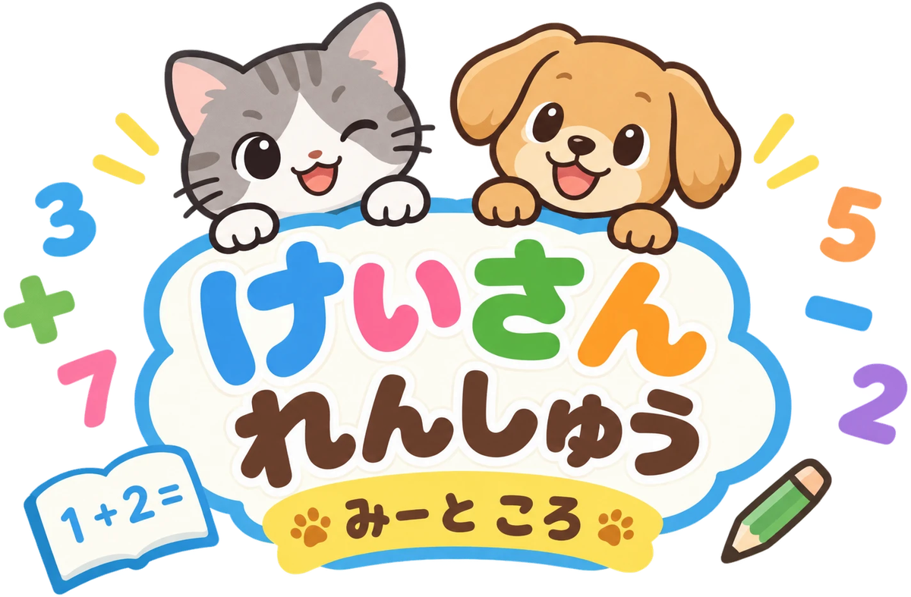

<p align="center">
  
</p>

<p align="center">
  <a href="https://kazukinakajimacat.github.io/keisan-renshu/"><b>▶ あそんでみる</b></a>
  ・
  <a href="CHANGELOG.md">更新履歴</a>
</p>

# けいさん れんしゅう　サービス紹介

小学1年生が、10までのたし算・ひき算を毎日楽しく続けるための練習ページです。ねこの みー と いぬの ころ が、いっしょに応援します。

---

## つくった目的

次の3つをテーマにしています。

1. 算数が好きになる
2. たし算とひき算がすらすら解ける基礎を作る
3. 毎日やっても飽きない

---

## 対象

- 小学1年生（たし算・ひき算を習い始めた子）
- 数の範囲は10まで。問題文はすべてひらがなと数字
- 答えは1〜10のボタンや絵のボタンを押して選ぶので、文字入力はいりません

---

## コースは3つ

### いろいろ もんだい

1問ずつ答えるコースです。問題は開くたびにランダムで、何問でも続けられます。

出題パターン

| パターン | 例 |
|---|---|
| しき | 3 + 4 = ? |
| あなあき | 3 + ? = 7 |
| いくつと いくつ | 7 は 4 と ? |
| え を みて | 10のわくに並んだ丸を数える |
| おはなし もんだい | みーと ころが出てくる文章題（ぜんぶで・のこり・ちがい） |
| みっつの かず | 3 − 1 + 4 = ? |
| なんばんめ？ | 🐱🐶🐰🐻 まえから 3ばんめは？／うしろから 2ばんめは？（絵のボタンで答える） |
| どちらが なんこ おおい？ | りんご5こ と みかん3こ。りんごは なんこ おおい？ |
| あと いくつ？ | 🍎🍎🍎🍎 あと いくつで 7こ？ |
| 10に なるのは？ | 7 と ? で 10（10のわくの絵でも出る） |
| ならべかえ | 3 8 1 5 を ちいさい じゅんに（数字を順にタップ） |
| つぎの かず | 1 → 2 → 3 → ?／9 → 8 → 7 → ?（ふえる・へる 両方） |
| まえの かず・うしろの かず | 5の ひとつ まえは？ |
| かずを あてよう | ヒント2〜3こで ひみつの かずを当てる（答えは必ず1つ） |
| かずの れつ | 1 2 □ 4 5 |
| どちらが おおきい？ | 3 と 7、おおきいのは どっち？／ちいさいのは どっち？ |

レベル

| レベル | 内容 |
|---|---|
| かんたん | しき、絵、いくつといくつ、やさしい文章題。数の意味の問題は「見てわかる」ものが中心 |
| ふつう | あなあき、ちがいの文章題、同じ記号の3つの数が加わる。ヒントの問題や比べる問題が増える |
| むずかしい | +と−をまぜた3つの数が中心。ならべかえは4〜5こ、2ずつ増える数の列なども出る |
| ちょう むずかしい | 大きい数の計算や+と−まぜの問題を多めに、16パターンすべてから出題。1問10秒の時間制限つき（ならべかえ・ヒントの問題は少し長め） |

数の意味の問題（なんばんめ〜どちらが おおきい）は、すべてのレベルで出ます。レベルが上がると、数が大きくなったり、向き（まえ・うしろ、ちいさい・おおきい）が入れかわったりします。

### ます けいさん

5×5の25ますを順番にうめていく、100ます計算の入門版です。たしざん・ひきざん・まぜまぜの3種類があり、タイムを計って自分の最高記録に挑戦できます。

### ずかん

がんばりが目に見える場所です。

- すらすら ずかん：たし算45個・ひき算45個の式が並び、速く正確に解けた式にシールが付く。シールは3段階で育つ
  - すらすら：続けて2回、時間内に正解
  - ぴかぴか：別の日にも時間内に正解（2日分）
  - きらきら：さらに別の日に3秒以内で正解（3日分）
  - 一度付いたシールは、間違えても下がらない
- シール ちょう：毎日もらった日替わりシールが並ぶ
- スタンプ カレンダー：めあてを達成した日にスタンプが付く。前の月もさかのぼって見られる

---

## 続けたくなる仕組み

- なかま そだて：月のはじめに届くたまごが、めあてをクリアした日数で育つ（たまご → あかちゃん → こども → わかもの → おとな → おとしより）。3日続けて休むといえでしてしまい、翌日に新しいたまごが届く。月末に旅立ってなかま ずかんに載る。生まれたら名前を付けられる（ひらがな5文字まで）
- MC：12しゅるいのなかまを全部旅立たせる（いえでは除く）と、好きななかまをMCに選べる（ずかん → なかま ずかん →「MCを えらぶ」）。なかまごとに性格と語尾が違い、問題・正解・まちがい・ヒントなどで話しかけてくれる。いつでも みー と ころ に戻せる。12しゅるい集め終わると、なかま そだては終わり（新しいたまごは届かない）
- 生まれるなかまは、まだ集めていない種類から先に出るので、毎月続ければ12か月で全種類そろう

- きょうの めあて：1日10問。達成するとスタンプが押され、ここで終わってもよい、という区切りになる
- 日替わりシール：絵柄は毎日変わる。まだ持っていない絵柄から先に出るので、毎日続ければ全種類そろう（そろったら2周目。2回目の絵柄には「2まいめ」と付く）。持っている絵柄は端末ごとに違うので、同じ日でも端末ごとに違うシールになる。その日に30問でノーマル、60問でレア、100問でスーパーレア、200問でウルトラレアに進化し、翌日はまた0から
  - いろいろ もんだい：1問解くごとに1問
  - ます けいさん：1枚やりきったら、正解したますの数だけ足す（途中でやめたら0）。全問正解で自己ベストを更新したら、さらに+5問
- ウルトラレアだけは、光が走ってキラン！と光る
- キャラクターの応援：正解すると喜び、間違えると励ましてくれる

---

## 力がつく仕組み

- 間違えたら、正しい答えを10のわくの図と短い言葉で見せる
- 間違えた問題は4問あと、時間がかかった問題は6問あとにもう一度出す
- 苦手な計算は、日をまたいでも多めに出す。式・文章題・あなあきなど形を変えて出すので、丸暗記では解けない
- 正答率が下がってきたら自動で易しめに、高いときは難しめに調整する
- 2問続けて間違えたら、次は必ず解ける問題をはさむ（ちょう むずかしいを除く）

---

## 保護者向けの機能

- 20問ごとに、ミスの傾向をまとめて表示する
  - たし算とひき算の正答率、パターン別の正解数
  - ミスの種類（答えが1ずれる、記号の取り違え、時間切れ など）
  - 時間がかかった問題、いま多めに出している問題
- これまでのまとめを、あとから見返せる

傾向は20問という少ない数から出しているので、1回分は目安です。2〜3回続けて同じ傾向が出たら、苦手と見るのがよさそうです。

---

## 記録の保存

- 記録は、使っている端末のブラウザの中（localStorage）だけに保存されます。ページを閉じても消えません
- サーバーには何も送らないので、ほかの人の記録が自分の端末に混ざることはありません
- 端末やブラウザが違えば、記録も別々です（家族で端末を分ければ、それぞれの記録になります）
- ブラウザの「履歴・サイトデータを消去」をすると記録も消えます
- 保存の状態は、ページの下に表示されます

---

## なかまの追加方法

1. `nakama/<id>/` フォルダに絵を入れる（egg_n, egg_h, baby_n/h/s, child_n/h/s, young_n/h/s, adult_n/h/s, elder_n/h/s, depart, letter。すべて .webp。letter がなければ共通の手紙を使う）
2. `nakama/nakama.js` のリストのいちばん最後に1行足す
3. 絵の作り方は `docs/ideas/nakama-sodate.md` を参照

---

## シール素材の追加方法

1. 画像（PNG・背景透明・正方形・256px 程度）を `stickers/` フォルダに入れる
2. `stickers/stickers.js` のリストの**いちばん最後**に1行足す
   ```js
   { id: "ファイル名と同じ英数字", name: "シールのなまえ", file: "ファイル名.png" },
   ```
   背景つきの丸いシールは `round: true` を付けると、枠いっぱいに大きく表示される
3. GitHub に push すると反映される

- `id` は一度決めたら変えない（もらったシールの記録に使うため）
- 行の順番を入れ替えたり、消したりしない
- もう出したくないシールは、行を消さずに `retired: true` を付ける（もらったシールはシール帳に残る）
- すでにもらったシールの絵柄は、素材を追加しても変わらない

---

## これから考えていること

- 繰り上がり・繰り下がりを習ったら、数の範囲を20までに広げる
- ます けいさんを、本来の10×10の100ますにする
- 文章題の読み上げ
- シールやキャラクターの種類を増やす
